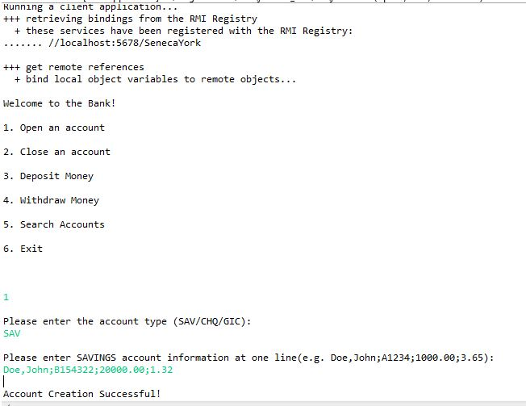
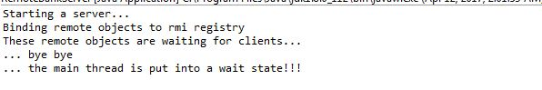
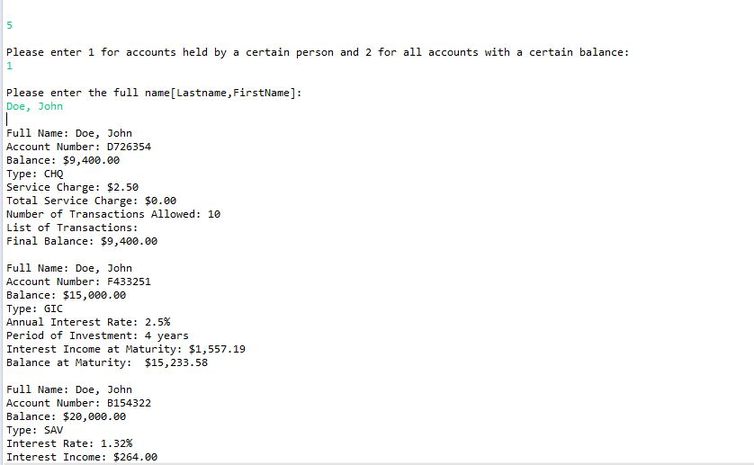
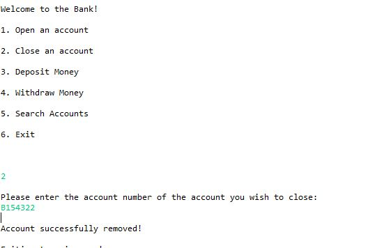

# Bank-RMI

## Description:

A Java program that uses Remote Method Invocation (RMI) to have multiple threads which allows  remote Bank objects to used. The Bank object has multiple Accounts which have deposit,
withdraw, open account and close account functionality. a single user can have multiple accounts and the program calculates tax and investment information for the user.

This program uses RMI functionality as well as threads, inheritance, exception handling, encapsulation and object oriented programming principles.  

## Output:

**Add Account With Existing Name**

**RMI Server**

**Search Account By Name**

**Delete An Existing Account**
